# SOCIAL.


## Description
SOCIAL is an API for a social network web application where users can share their thoughts, react to freinds' thoughts, and create a friend list.

    The motivation behind SOCIAL was simply to practice building an API route backend using NoSQL.

## Table of Contents

* **[Installation](#installation)**<br />
* **[Usage](#usage)**<br />
* **[License](#license)**<br />
* **[Contributing](#contributing)**<br />
* **[Contact](#contact)**<br />

### Installation
<a name="installation"/>

```
npm i
```

### Usage
<a name="usage"/>
Simply run the command `npm start` to spin up the server. Then, using a third party application like "Postman" or "Insomnia" you will be able to interact with the database and test the API routes, via your localhost on port  3001.<br/>

User-routes:<br/>
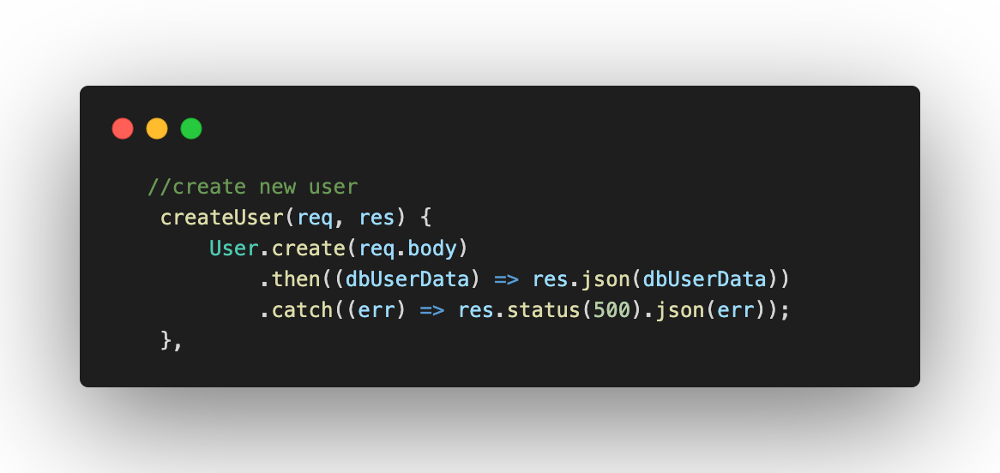<br/>
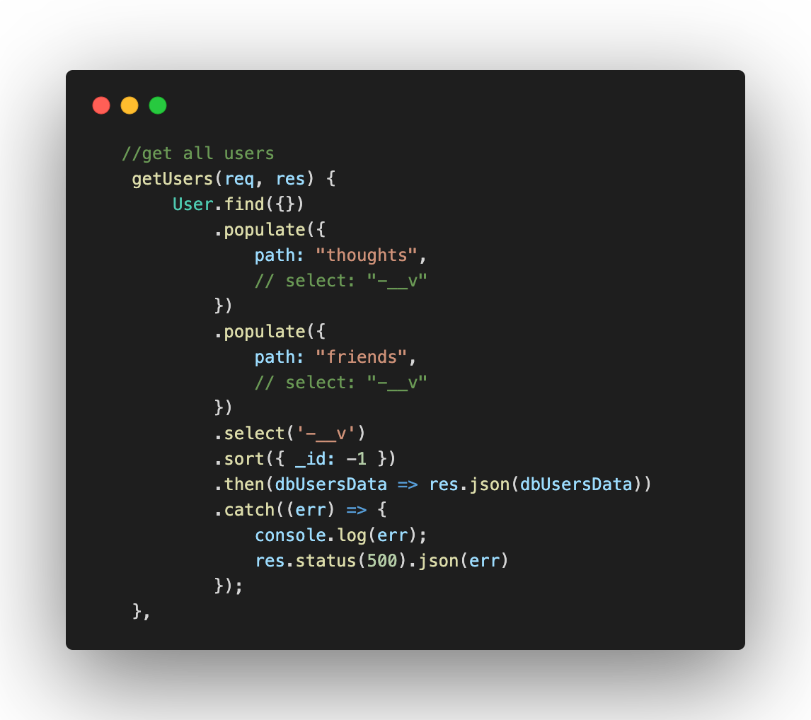<br/>
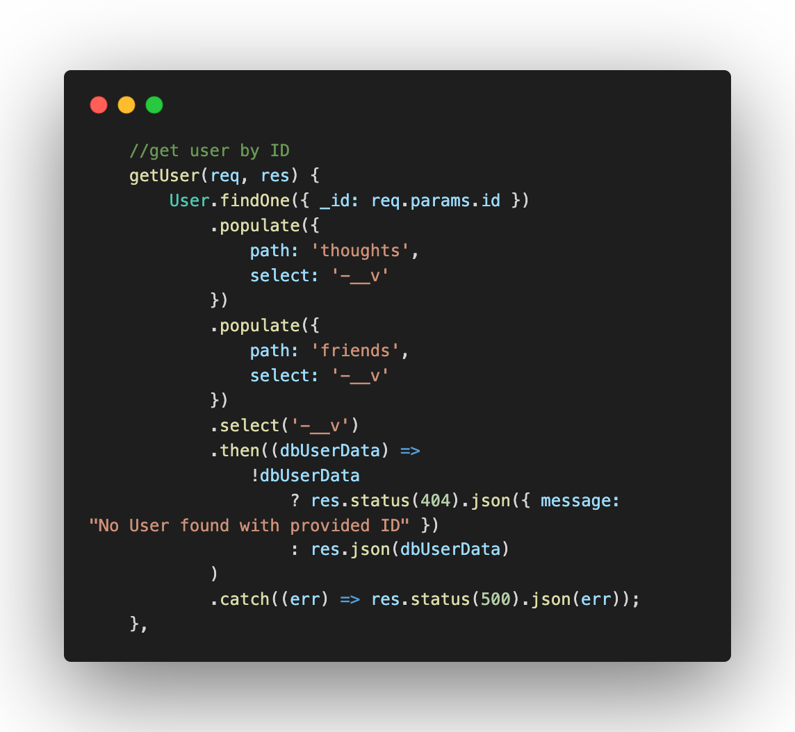<br/>
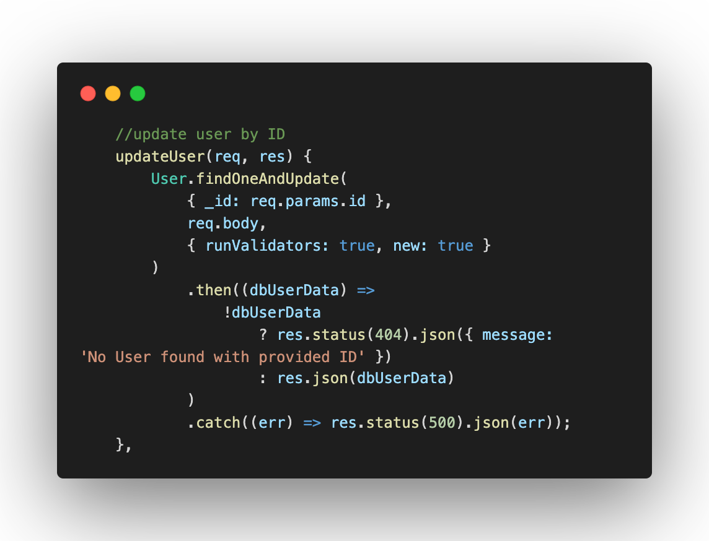<br/>
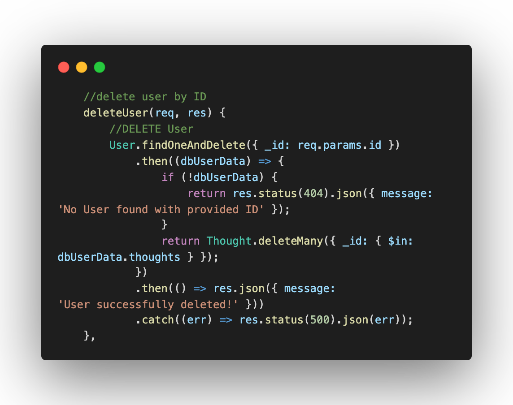<br/>
Thought-routes:<br/>
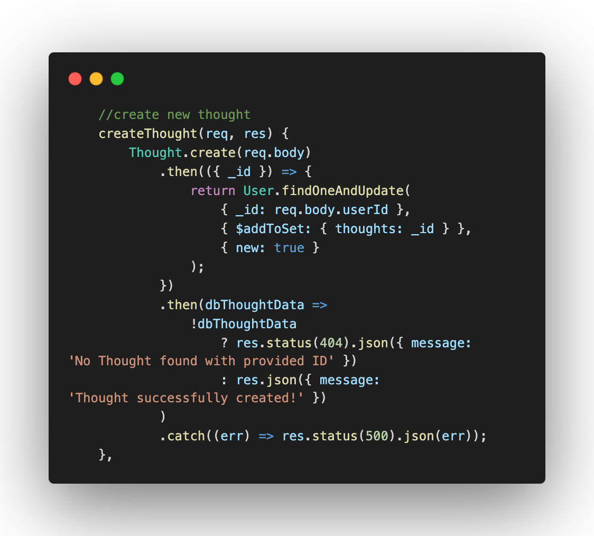<br/>
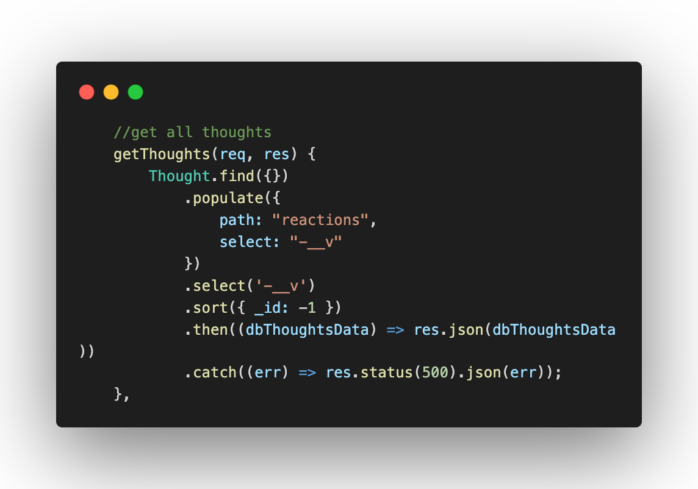<br/>
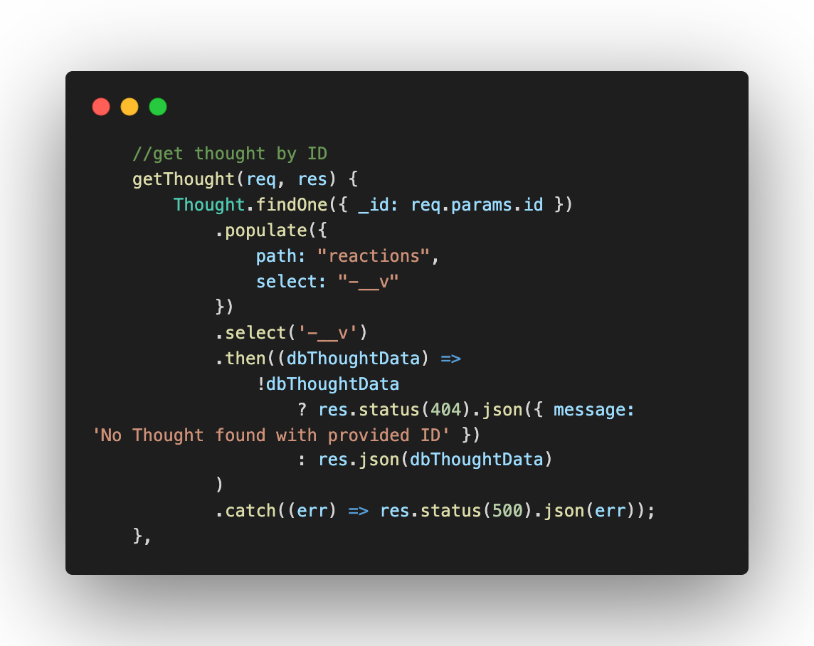<br/>
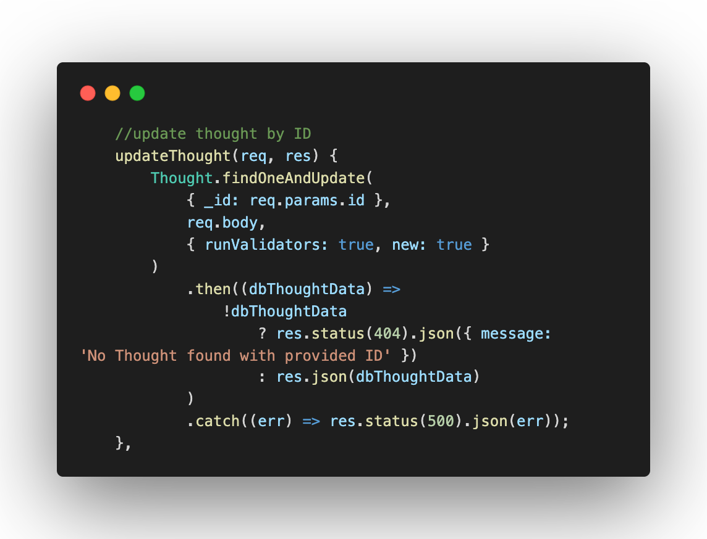<br/>
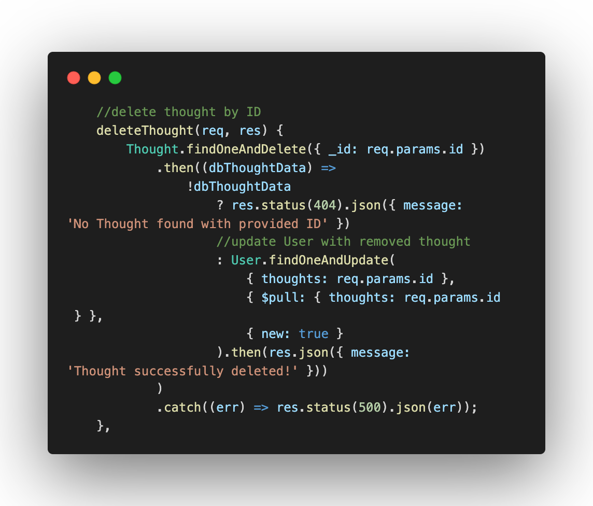<br/>
Friend-routes:<br/>
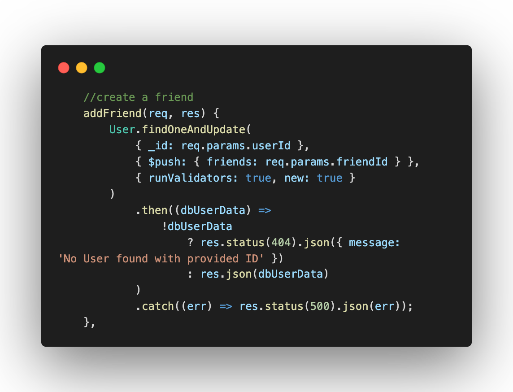<br/>
<br/>
Reaction-routes:<br/>
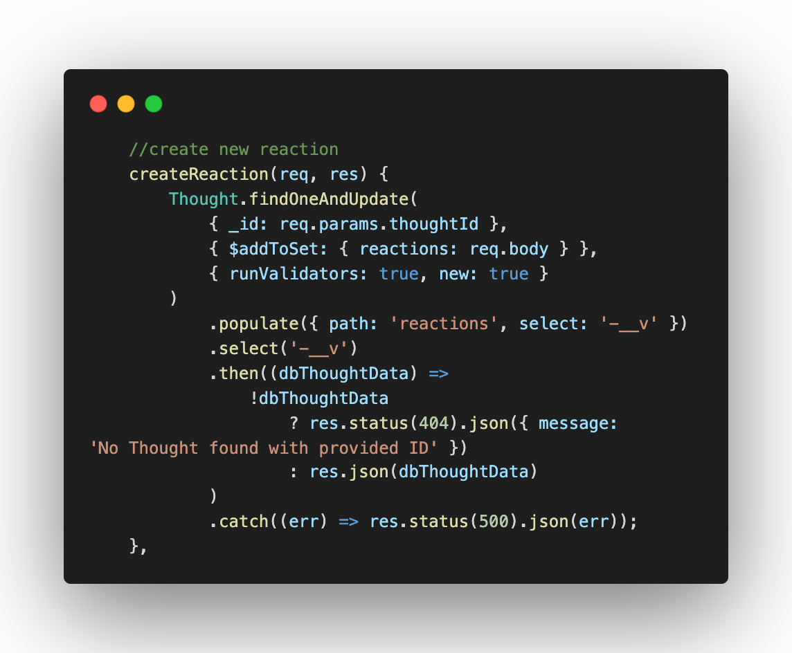<br/>
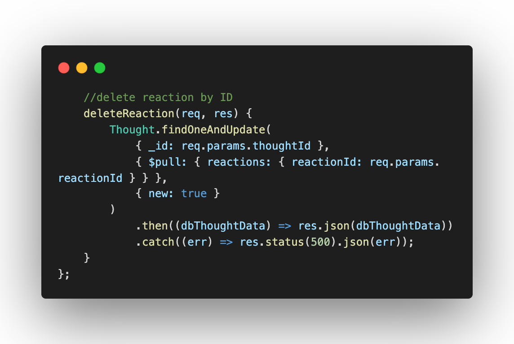<br/>

### License
<a name="license"/>

<a href="https://choosealicense.com/licenses/mit/">mit</a><br/>
            For more information on the coverage of this license please click on the link above.

### Contributing
<a name="contributing"/>
hackpres is the primary contributor.


### Contact
<a name="contact"/>
for questions please contact <a href="https://github.com/hackpres">hackpres</a><br/>

